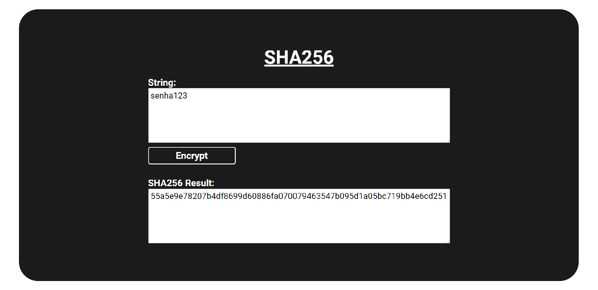

# SHA256 - Encrypt

Neste projeto, fiz um simples conversor de texto para um hash em SHA256, utilizando a bilbioteca [`crypto-js`](https://www.npmjs.com/package/crypto-js).

### 
<a href="https://luizfranzon.github.io/sha256-encrypt/SHA256-Page/index.html">Experimente aqui!</a>

